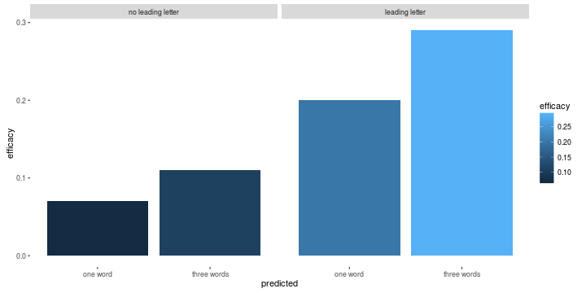

NexWord: Predictive Text Model
========================================================
author: Matthew Sedlar 
date: 

Goals
========================================================

With NexWord, I set the following goals for developing a model.

* The model should respond to user input by chaining together n-grams using the probability of a word appearing based on the last word or first letter of the next word.
* The model should continue to learn from user input. 
* The model should balance speed and accuracy, with an emphasis on speed for improved user experience.

How it Works
========================================================

Once a user enters a phrase, if there is a space at the end of the sentence, the next word is predicted. If there is a leading letter or an incomplete word at the end, the word is predicted based on that input. The model uses conditional probability. In the example of a 2-gram, if the first word is *good*, it looks for the probability that the next word would be *day* using the following formula. 

$$P(\mbox{day}|\mbox{good}) = \frac{P(\mbox{good day})}{P(\mbox{good})}$$

My model searches a dictionary consisting of 1-grams, 2-grams, 3-grams and 4-grams. If the phrase is not found in the 4-grams, for example, I use backoff smoothing and search 3-grams with a backoff weight of 0.40.

How it Performs
========================================================

In order to boost performance without checking user input against more data, which would create lag, the model displays the top three predicted outcomes instead of one. This is standard on many smart device keyboards, and it increases the efficacy of the model without affecting speed, as the plot below shows:

A Learning Model
========================================================

Since the model uses a lightweight dictionary for speed, users have the option to submit a phrase to the dictionary. The next time the app loads, the phrase will be included in the dictionary. 

Simply type in a phrase and click on 'Submit Phrase to Dictionary' under the text box.

For now, this is an opt-in function as the process of tokenizing and adding a phrase to the dictionary can be time and memory intensive. 
